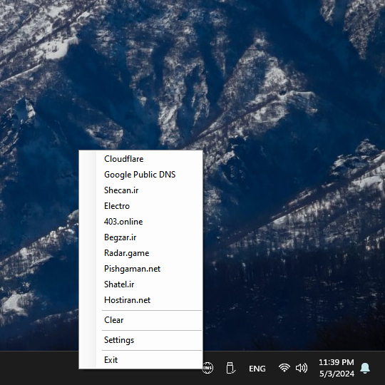
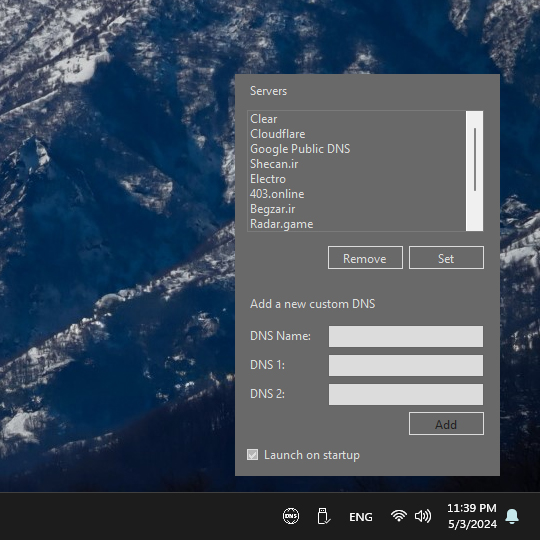

# DNS on Tray
A simple program to easily add, remove or change current DNS of the Windows. This program helps you to easily change your computer's DNS through the system tray with just one click.

## Please Pay Attention
- This program currently only supports IPv4.
- This program is made for my personal use. If you also use this program and need some features, please open an issue for it.
- This program is currently unsigned. You can download its codes or use unsigned releases.

## Screenshot
 

## Supported DNS Servers by Default
- Cloudflare
- Google Public DNS
- Shecan.ir
- Electro
- 403.online
- Begzar.ir
- Radar.game
- Pishgaman.net
- Shatel.ir
- Hostiran.net

## To-Do List Without Specific Order
- [ ] Support Ipv6
- [ ] Support Single DNS
- [ ] Package & Sign Releases
- [ ] Selected DNS Status (Which DNS is Selected?)
- [ ] Form Validation (Is DNS Entered in Correct Way?)
- [ ] Check DNS Health (Does it Working?)
- [ ] Test Overall Functionality on Windows 10 (I Just Tested on Windows 11)
- [ ] Make a Logo
- [ ] Better Icon for System Tray
- [ ] Farsi UI
- [ ] Gilaki UI

## Releases
You can always download the last releases [here](https://github.com/LordArma/DNS-on-Tray/releases).
