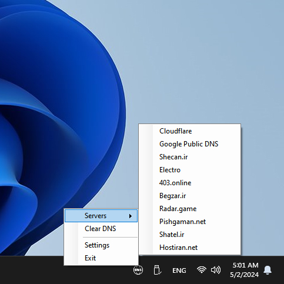

# DNS on Tray
A simple program to easily add, remove or change current DNS of the Windows.

## Please Pay Attention
- This program currently only supports IPv4.
- This program is made for my personal use. If you also use this program and need some features, please open an issue for it.
- This program is currently unsigned. You can download its codes or use unsigned releases.

## Screenshot

## Supported DNS Servers by Default
- Cloudflare
- Google Public DNS
- Shecan.ir
- Electro
- 403.online
- Begzar.ir
- Radar.game
- Pishgaman.net
- Shatel.ir
- Hostiran.net

## Releases
You can always download the last releases [here](https://github.com/LordArma/DNS-on-Tray/releases).
