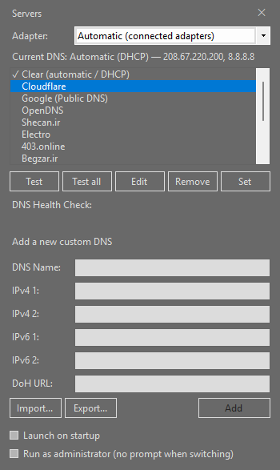
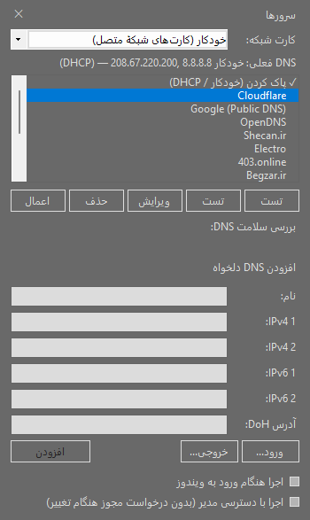
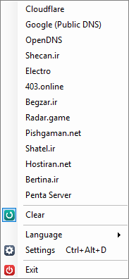

# DNS on Tray
A simple program to easily add, remove or change the DNS of Windows. Pick a DNS server from the system tray with one click, see which one is active, and test which one is fastest.

## Screenshots
<table>
  <tr>
    <th>English</th>
    <th>Farsi</th>
  </tr>
  <tr>
    <td></td>
    <td></td>
  </tr>
</table>



## Features
- **One-click switching** from the tray menu. A left click on the tray icon (or **Ctrl+Alt+D**) opens the settings window.
- **See the active DNS**: a ✓ next to it in the menu and the list, a "Current DNS" line, and a green dot on the tray icon while a custom DNS is set.
- **IPv4 and IPv6** servers; the second server is optional.
- **DNS over HTTPS (DoH)** on Windows 11: entries with a DoH URL use encrypted DNS automatically.
- **Health check**: *Test* sends a real DNS query to each server of the selected entry; *Test all* sorts the list by speed. It warns when a VPN/proxy intercepts DNS, since the results would be meaningless.
- **Choose the network adapter** to change, or let the app use every connected adapter.
- **Add, edit and remove** your own servers; **import/export** the list as a JSON file.
- **Run as administrator** option: asks for permission once, so switching no longer shows a UAC prompt every time.
- **Launch on startup**.
- **English and Farsi** interface (follows the Windows language, or pick one from the tray menu).

## Default DNS Servers
- Cloudflare (with IPv6 and DoH)
- Google Public DNS (with IPv6 and DoH)
- OpenDNS (with IPv6 and DoH)
- Shecan.ir
- Electro
- 403.online
- Begzar.ir
- Radar.game
- Pishgaman.net
- Shatel.ir
- Hostiran.net
- Bertina.ir
- Penta Server

## Download
Download the latest version from the [releases page](https://github.com/LordArma/DNS-on-Tray/releases), unzip it and run `DNS on Tray.exe`. The release build includes .NET, so nothing else needs to be installed.

Please note:
- Windows 10 or 11 is required; DNS over HTTPS needs Windows 11.
- The program is unsigned, so Windows SmartScreen may warn the first time you run it.
- Changing DNS needs administrator permission (see the *Run as administrator* option).

## Build from Source
Requires the [.NET 10 SDK](https://dotnet.microsoft.com/download) on Windows.

```powershell
dotnet build
dotnet test
dotnet run --project "DNS on Tray"

# Single-file release build (includes .NET):
dotnet publish "DNS on Tray" -c Release -r win-x64
```

## To-Do List Without Specific Order
- [x] Support IPv6
- [x] Support Single DNS
- [x] Selected DNS Status (Which DNS is Selected?)
- [x] Form Validation (Is DNS Entered in Correct Way?)
- [x] Check DNS Health (Does it Working?)
- [x] Better Icons
- [x] Farsi UI
- [x] DNS over HTTPS
- [x] Import/Export Servers
- [ ] Sign Releases
- [ ] Test Overall Functionality on Windows 10
- [ ] Gilaki UI

## License
[MIT](LICENSE.txt)
